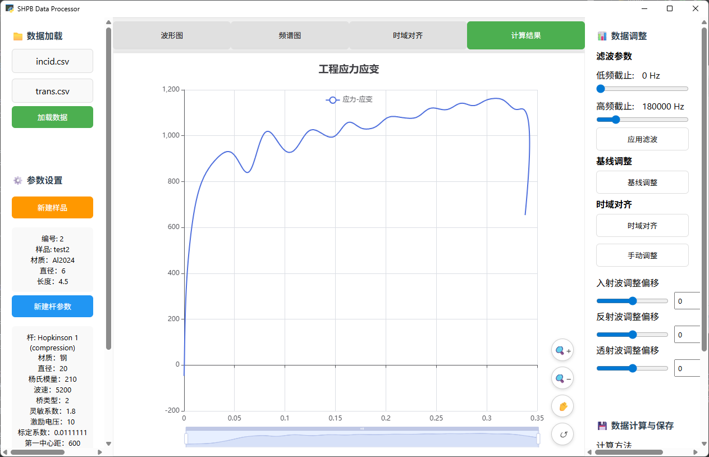

# Hopkinson Bar Data Processing Software
[English](README_EN.md) | [中文](README.md)

## 1. Introduction to Hopkinson Bar

### Working Principle
The Hopkinson Bar is an experimental device used to test the mechanical properties of materials under high strain rates. This technology was invented by British scientist Bertram Hopkinson in the early 20th century, primarily for studying the stress-strain relationship of materials under dynamic loads.

The Hopkinson Bar system consists of an incident bar, a transmission bar, and an absorption bar, measuring the dynamic mechanical properties of materials through the propagation of stress waves in the bars.


## 2. Software Usage Instructions

### 2.1 Program Dependencies

This software is developed using Python and Java. The required Python libraries are listed below:
```
pip install numpy scipy pandas pywebview
```


### 2.2 Software Interface


### 2.3 Operating Procedure
1. **Data Loading**: Import incident wave and transmission wave data files
Click on the top left to select the incident wave file and transmission wave file, then click the "Load" button to import. The file type is generally CSV format, with data format as two columns: the first column is the time axis, and the second column is the waveform data.

2. **Parameter Settings**: Configure sample parameters and bar parameters
Create New Sample: Fill in sample parameters and click the "Save" button to save. The required fields are: sample number, sample name, sample material, cross-sectional diameter, and sample length.
Create New Bar: Fill in bar parameters and click the "Save" button to save. The required fields are:
Bar mode, bar material, cross-sectional diameter, Young's modulus, sound velocity, bridge type, Gage factor, excitation voltage, calibration coefficient, Poisson's ratio, damping coefficient, etc.

3. **Data Selection**
Hold Ctrl and drag with the left mouse button in the raw data to select the range for incident wave, reflected wave, and transmitted wave data.

4. **Data Processing**: Perform filtering, baseline adjustment, time-domain alignment, and other processing
Filtering: After importing data, there is a frequency distribution diagram in the spectrum chart. Appropriate upper and lower filter frequency parameters can be selected for filtering based on needs.
Baseline Adjustment: After inputting waveform data, click the "Baseline Adjustment" button and move the slider according to the prompts to adjust the baseline.
Time-domain Alignment: Clicking directly will align the three waveforms in time, but this is generally not accurate enough. Click the "Manual Adjustment" button to manually adjust the time axis alignment according to the prompts.
Manual Adjustment: Click the "Manual Adjustment" button and manually adjust the sliders according to the prompts to align the time axis of the three waveforms. Generally, the first peak of the waveform is taken as the alignment standard, as shown below:


5. **Calculation Analysis**: Select appropriate calculation methods for data analysis
After selecting a calculation method, different calculation methods will have varying calculation effects. Choose the appropriate method based on needs, referring to the [National Standard](https://openstd.samr.gov.cn/bzgk/std/newGbInfo?hcno=D484174464EFFF3C22B1B8CEABF87E20). Click the "Calculate" button to perform calculations.

6. **Result Export**: Save processing results
Click the "Save" button, select the file save path, and the processing results will be saved as CSV files along with the sample and bar configuration JSON information.

## 3. Parameter Descriptions

### 3.1 Sample Parameters
- **Sample Number**: Unique identifier for the sample
- **Sample Name**: Name or description of the sample
- **Sample Material**: Material type of the sample
- **Cross-sectional Diameter**: Cross-sectional diameter of the sample (mm)
- **Sample Length**: Length of the sample (mm)

### 3.2 Bar Parameters
- **Bar Mode**: Compression or tension bar mode
- **Bar Material**: Material type of the bar
- **Cross-sectional Diameter**: Cross-sectional diameter of the bar (mm)
- **Young's Modulus**: Elastic modulus of the bar (GPa)
- **Sound Velocity**: Propagation speed of stress waves in the bar (m/s)
- **Bridge Type**: Strain gauge bridge circuit type (quarter bridge, half bridge, full bridge)
- **Gage Factor**: Sensitivity coefficient of the strain gauge
- **Excitation Voltage**: Excitation voltage of the strain gauge bridge circuit (V)
- **Calibration Coefficient**: System calibration coefficient
- **Poisson's Ratio**: Poisson's ratio of the bar material
- **Damping Coefficient**: System damping coefficient

### 3.3 Calculation Parameters
- **Low-frequency Cutoff**: Low-frequency cutoff of the filter (Hz)
- **High-frequency Cutoff**: High-frequency cutoff of the filter (Hz)
- **Calculation Methods**:
  - Two-wave method (incident + transmitted)
  - Two-wave method (reflected + transmitted)
  - Three-wave method

## 4. National Standard Reference

### 4.1 Main Standards
This software was developed with reference to the following national standards:

[GB/T 37271-2018](https://openstd.samr.gov.cn/bzgk/std/newGbInfo?hcno=D484174464EFFF3C22B1B8CEABF87E20)
"Hopkinson Bar Method for Determining Dynamic Compressive Mechanical Properties of Metallic Materials"

## 5. Contact Information

For questions or suggestions, please contact:
- Developer: [Tang Lifa(SWJTU)]()
- Email: [Contact Information]()
- Project Address: [Hopkinson](https://github.com/Mr-tang0/Hopkinson.git)